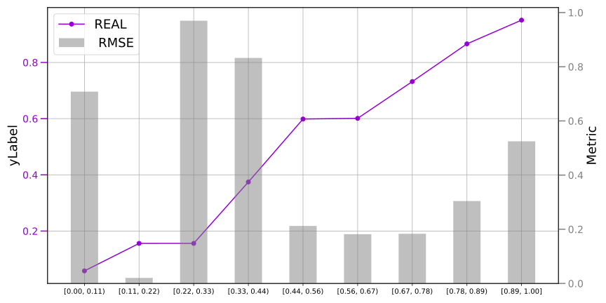
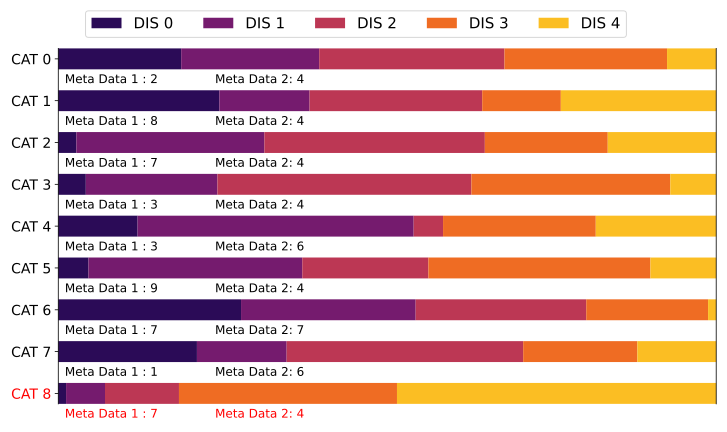
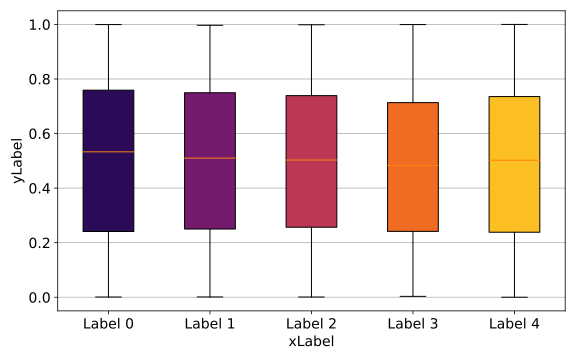
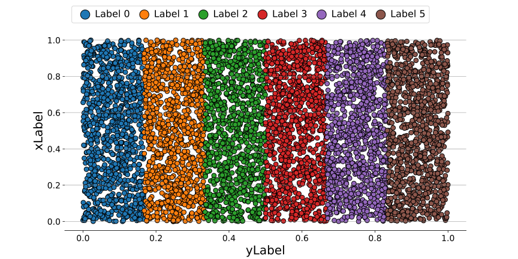
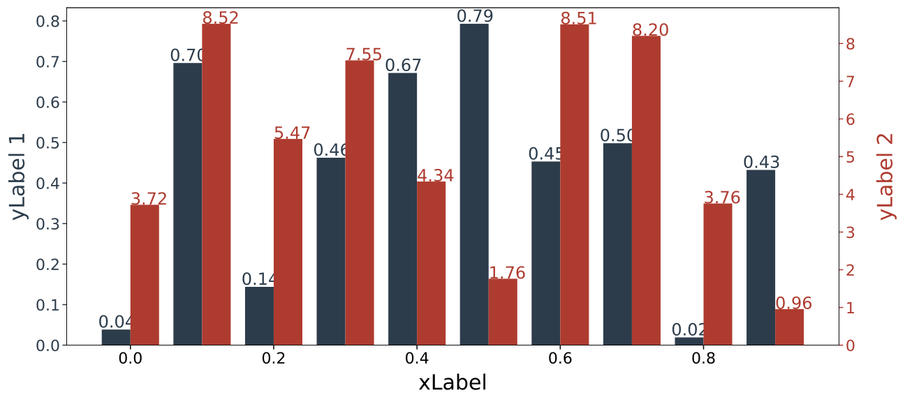
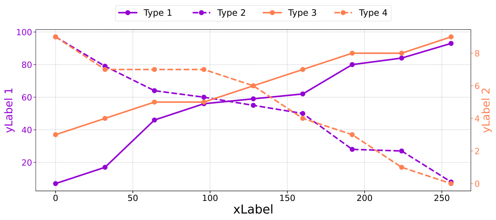
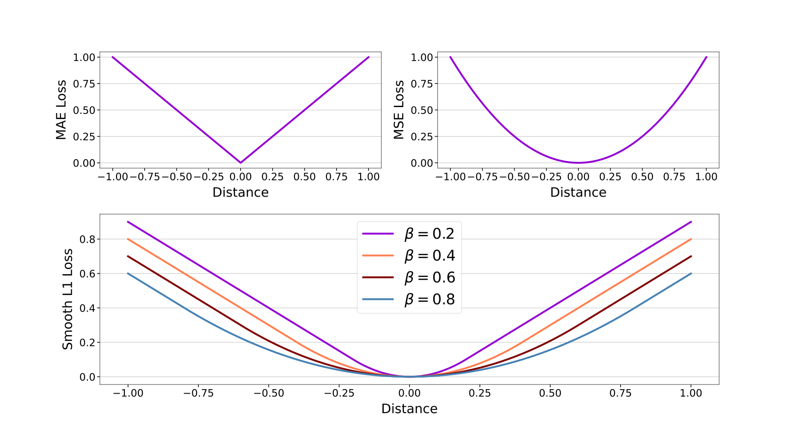
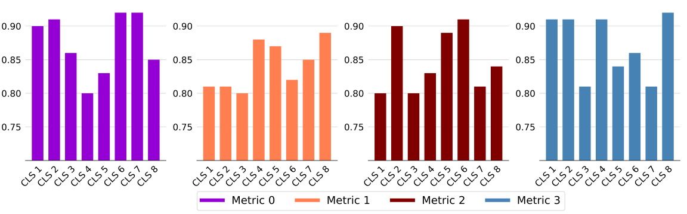

# Figure Example
The figures I created in data analysis, most of which are based on matplotlib, including:
- bar and curve

  

- horizontal stack

  

- boxplot

  

- colorful scatter

  

- dual bar

  

- multi curve

  

- multi figure layout

  

- multi group bar

  

The first and most important step to use matplotlib is recognizing each figure element:

  

Google with the name of element you want to adjust will address all your problems.